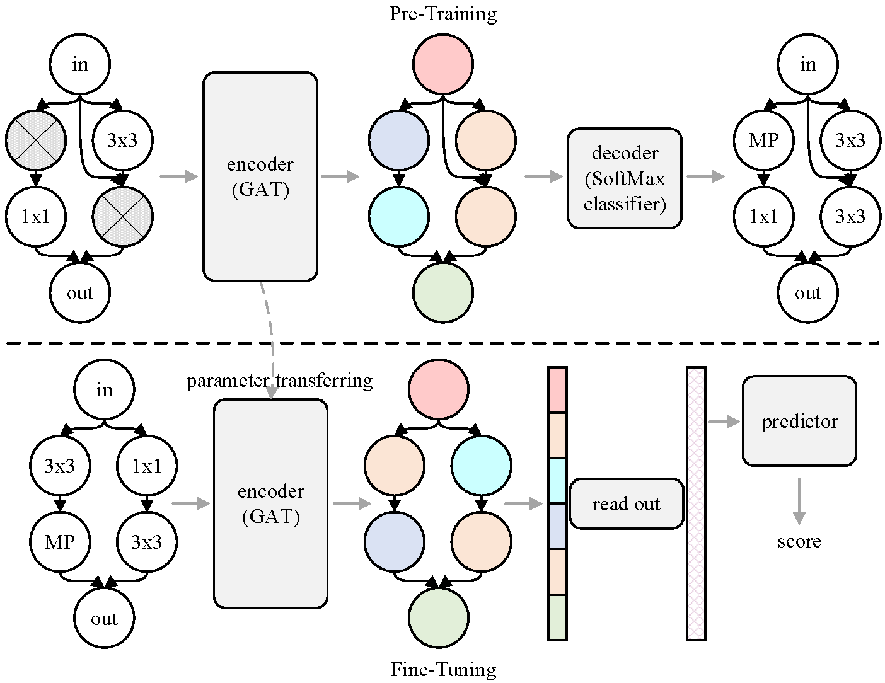
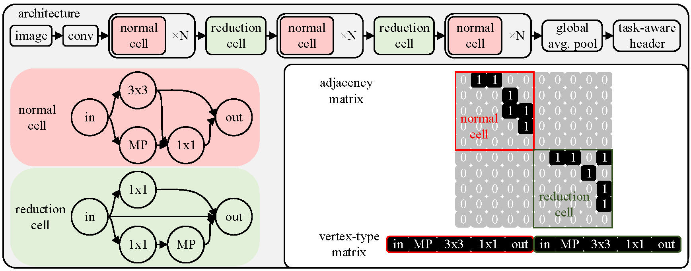
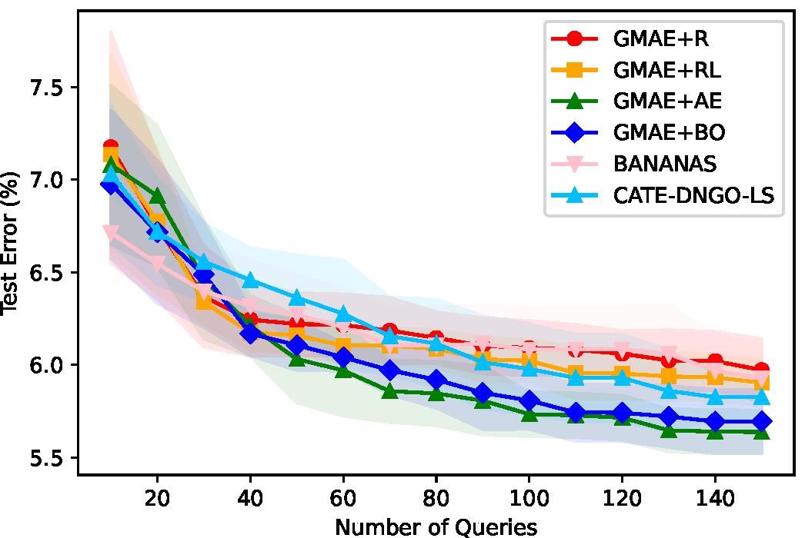
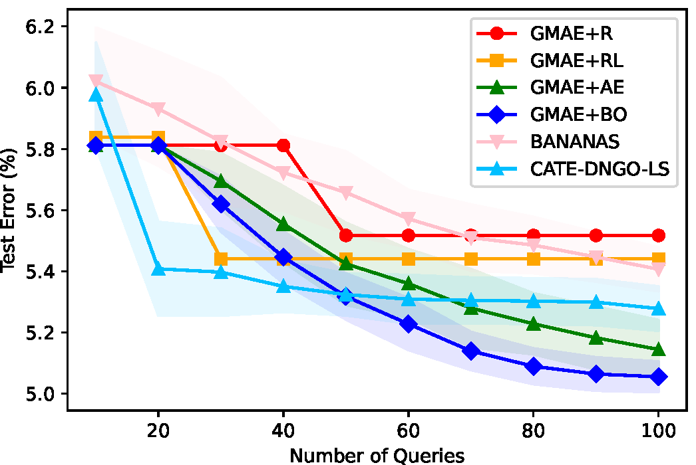
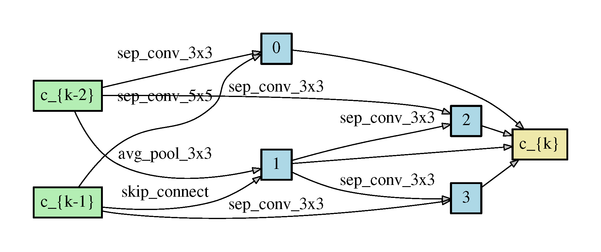
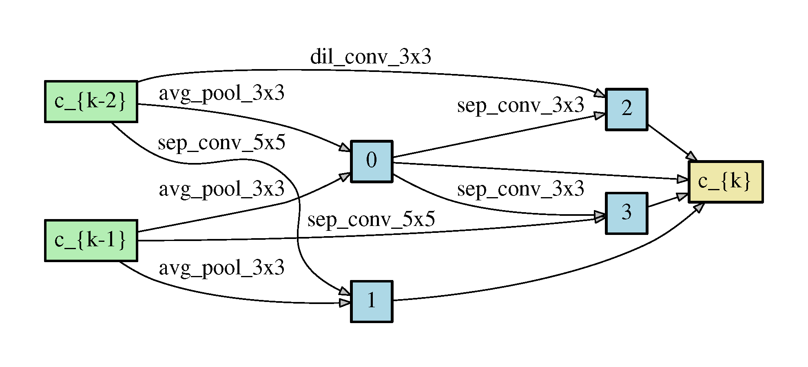
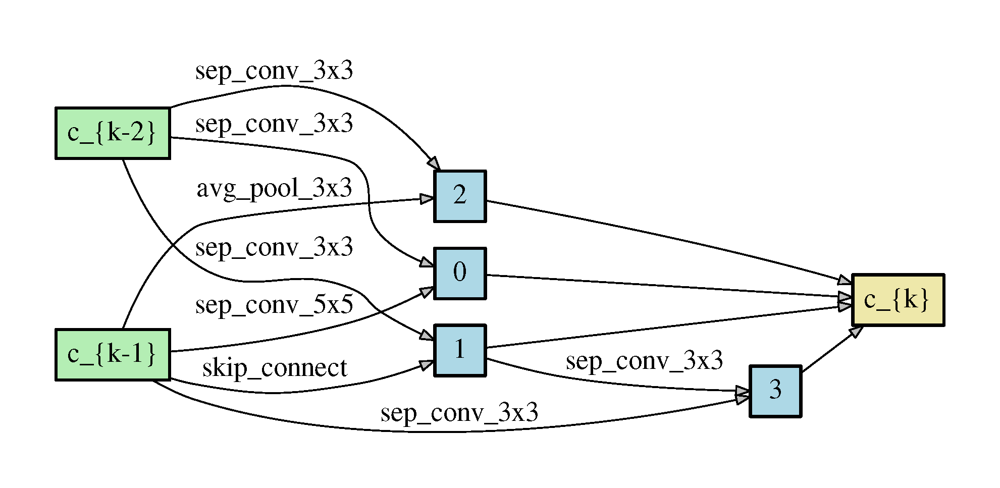

# Graph Masked Autoencoder Enhanced Predictor for Neural Architecture Search

This repository is the official implementation of Graph Masked Autoencoder Enhanced Predictor for Neural Architecture Search.

<p align="center">
    
</p>
<p align="center">
    The overview of GMAE.
</p>

<p align="center">
    
</p>
<p align="center">
    The architecture space and its representation..
</p>

## Citation

If you use any part of this code in your research, please cite our paper:

```
@inproceedings{jing2022gmae,
  title={Graph Masked Autoencoder Enhanced Predictor for Neural Architecture Search},
  author={Kun Jing, Jungang Xu, and Pengfei Li},
  booktitle={Proc. of IJCAI},
  year={2022}
}
```

## Requirements

```setup
Python>=3.8, PyTorch==1.9.0, torchvision==0.10.0, torch-cluster==1.5.9, torch-geometric==1.7.2, torch-scatter==2.0.8, torch-sparse==0.6.12
```

## Data Preparation
The default path of the NAS benchmark data and CIFAR-10 dataset is in ~/datasets.

Using gen_json_301.py to generate 100,000 architectures in NAS-Bench-301 for pre-training.

## Pre-Training

To pre-train the GMAE, run this command:

```pre-train
python pretrain.py --space [space_name] --save [save path] [--finetune_fixed_encoder] --param local:[json filename of params] --finetune_train_samples [number of queries] --finetune_batch_size [recommend to set it to one tenth of number of queries] [...]
```

## Fine-Tuning / Training from Scratch

To fine-tune or train the predictor, run this command:

```fine-tune
python finetune.py --space [space_name] --save [save path] [--finetune_fixed_encoder] --param local:[json filename of params] --finetune_train_samples [number of queries] --finetune_batch_size [recommend to set it to one tenth of number of queries] --model_state_dict [model state dict name; ignore it when training from scratch] [...]
```

## Search

Run this command for search:

```search
python search.py --search_space [space_name] --search_algo [algorithm name] --dataset [dataset name] --outdir [output dir] --encoder_model_state_dict [state dict path] [...]
```

## Train on CIFAR-10

To train the discovered architecture on CIFAR-10 in the paper, run this command:

```train
python train.py --arch [your architecture] [...]
```

## Scripts

| Script | description |
| ------ | ----------- |
| nni4nasbench<font color="#ff0000">xxx</font><font color="#00ff00">yyy</font>.py/.sh | search hyper-params for <font color="#00ff00">yyy</font> (including pre-training, fine-tuning, and training from scratch) on NAS-Bench-<font color="#ff0000">xxx</font>. Note: Using the same hyper-params for DARTS space as the NAS-Bench-301. |
| search<font color="#ff0000">xxx</font>.sh | search on NAS-Bench-<font color="#ff0000">xxx</font>.|
| pretrain_task.sh | Ablation study for choice of pre-training methods.|
| masking_ratio.sh | Ablation study for choice of masking ratios.|
| pretrain_target.sh | Ablation study for choice of objective functions.|
| encoder_decoder.sh | Ablation study for choice of models.|
| finetune_target.sh | Ablation study for choice of fine-tuning targets.|
| finetune_mode.sh | Ablation study for choice of fine-tuning modes.|

## Results on NAS Benchmark

<p align="center">
    
    
</p>
<p align="center">
    The search process on NAS-Bench-101 (left) and NAS-Bench-301
(right).</p>

## Results on CIFAR-10

<p align="center">
    
    
</p>
<p align="center">
    The architecture discovered by GMAE-NAS (AE).
</p>
</p>

<p align="center">
    
    
</p>
<p align="center">
    The architecture discovered by GMAE-NAS (BO).
</p>
</p>

| Architecture | Test Error (%) | #Params (M) | Search Cost (GPU days) | Search Type |
| ------------ | -------------- | ----------- | ---------------------- | ----------- |
| GMAE-NAS (AE)| 2.56 $\pm$ 0.04  | 4.0         |     3.3                |AE+neural predictor|
| GMAE-NAS (BO)| 2.50 $\pm$ 0.03  | 3.8         |     3.3                |BO+neural predictor|
